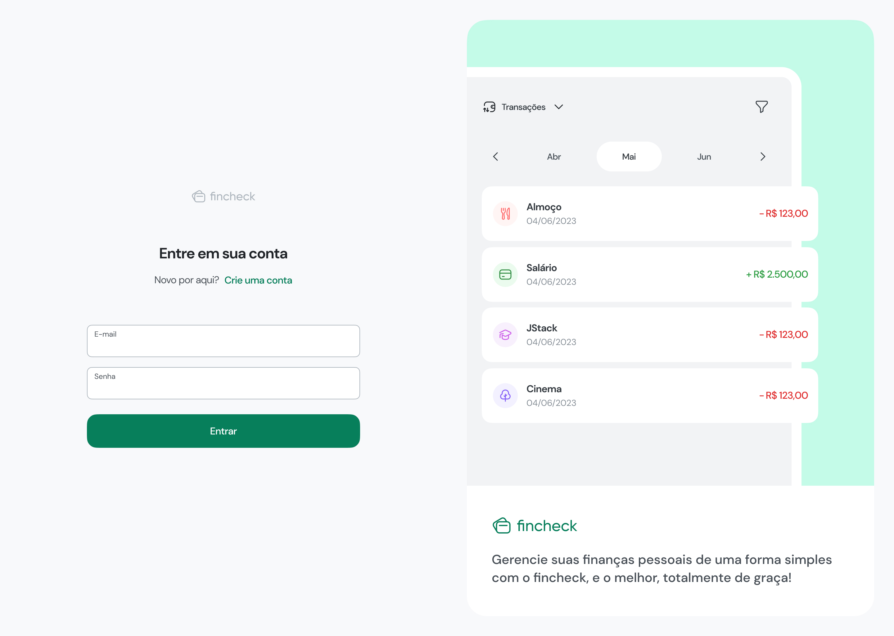
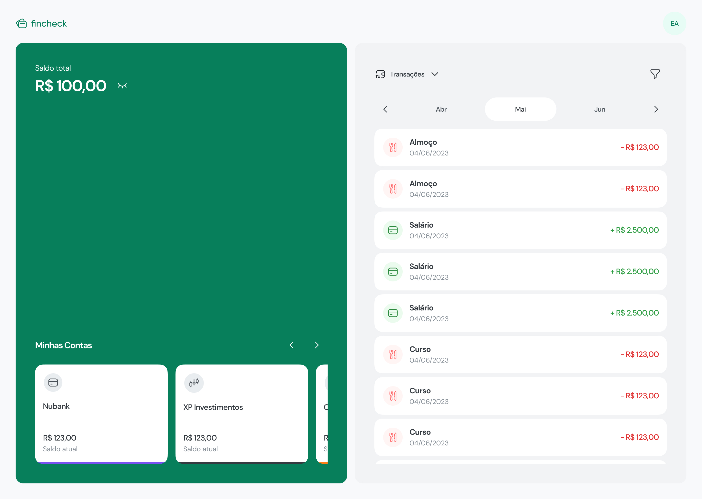
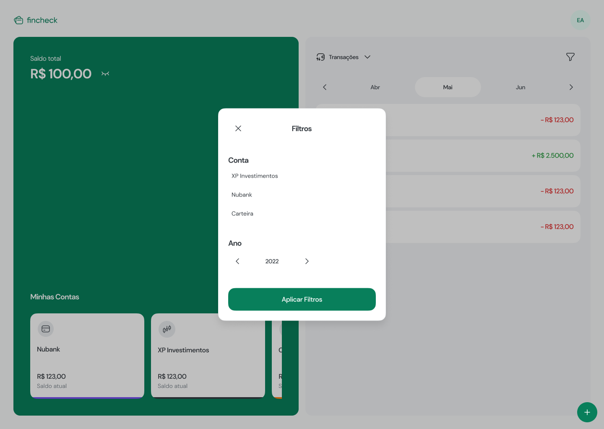

<h1 align="center">Fincheck</h1>


<p align="center">
  <a href="#dart-about">About</a> &#xa0; | &#xa0; 
  <a href="#rocket-technologies">Technologies</a> &#xa0; | &#xa0;
  <a href="#white_check_mark-requirements">Requirements</a> &#xa0; | &#xa0;
  <a href="#checkered_flag-starting">Starting</a> &#xa0; | &#xa0;
  <a href="https://github.com/davi1985" target="_blank">Author</a>
</p>

## :dart: About

**FINCHECK** is a personal finance management application. Easily track your expenses with filtering options by account, category, and date.

> 🚧 The project is currently under development.

---

## ✅ Development Progress

### Back-end

- [x] NestJS project structure
- [x] Docker PostgresSQL setup
- [x] Prisma setup
- [x] User creation
- [x] Access Token - JWT
- [x] Bank Account
- [x] Category
- [x] Transactions
- [x] Transactions filters

### Front-end (Web)

- [ ] Project setup with React + Vite
- [ ] Login page UI
- [ ] Home page with expense list
- [ ] Expense registration form
- [ ] Category and account management screens
- [ ] Filter by category, date, and account
- [ ] API integration with React Query
- [ ] Form validation with Zod

## Preview

### Login Page



### Home Page



### Home Page with Filters



## :rocket: Technologies

The following tools were used in this project:

### Back-end

- [Node.js](https://nodejs.org/en/)
- [NestJS](https://nestjs.com/)
- [TypeScript](https://www.typescriptlang.org/)
- [PostgreSQL](https://www.postgresql.org/)
- [Prisma](https://www.prisma.io/)
- [Docker](https://www.docker.com/)
- [JWT](https://jwt.io/)

### Front-end (Web)

- [React](https://reactjs.org/)
- [Vite](https://vitejs.dev/)
- [TypeScript](https://www.typescriptlang.org/)
- [Tailwind CSS](https://tailwindcss.com/)
- [React Query](https://tanstack.com/query/latest)
- [Zod](https://zod.dev/)

## :white_check_mark: Requirements

Before starting :checkered_flag:, you need to have [Git](https://git-scm.com) and [Node](https://nodejs.org/en/) installed.

## :checkered_flag: Starting

```bash
# Clone this project
$ git clone https://github.com/davi1985/fincheck

# Access
$ cd fincheck

# To access backend
$ cd api

# Install dependencies
$ yarn

# Run the API
$ yarn start:dev

# To access frontend
$ cd frontend

# Install dependencies
$ yarn

# Run the frontend
$ yarn dev
```

Made with :heart: by <a href="https://github.com/davi1985" target="_blank">Davi Silva</a>

&#xa0;

<a href="#top">Back to top</a>
